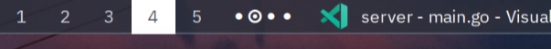

# niri-windows module for Waybar

This is a WIP module for [Waybar](https://github.com/Alexays/Waybar) that displays a window minimap for the current [niri](https://github.com/YaLTeR/niri) workspace.




> [!IMPORTANT]
> niri ≥ v25.08 is required (for the window locations in IPC messages to be available).

## Installation

Download the latest release for your platform from the [releases
page](https://github.com/calico32/waybar-niri-windows/releases). You can place
the `.so` anywhere permanent. `~/.config/waybar` is a good place.

### From source

If you'd like to build from source (or if your platform doesn't have a pre-built binary):

1. Install GTK 3 + development headers (`apt install libgtk-3-dev`, `pacman -S gtk3`, etc.).
2. Clone this repository.
3. Run `make waybar-niri-windows.so` to produce `waybar-niri-windows.so`. This might take a while (thanks to cgo).

Move the library anywhere permanent, e.g. `~/.config/waybar`.

## Configuration

Add a CFFI module to your Waybar config (and add any niri actions you want to trigger on scroll):

```jsonc
{
  "modules-left": ["cffi/niri-windows"],
  "cffi/niri-windows": {
    // path where you placed the .so file
    "module_path": "/home/calico32/.config/waybar/waybar-niri-windows.so",
    // configure the module's behavior
    "options": {
      // set the module mode
      // "graphical" (default): draw a minimap of windows in the current workspace
      // "text": draws symbols and a focus indicator for each column (mirrors v1 behavior)
      "mode": "graphical",

      // ======= graphical mode options =======
      //  when to show floating windows
      //   - "always": always show floating window view, even if there are no floating windows
      //   - "auto" (default): show floating window view if there are floating windows on the current workspace
      //   - "never": never show floating windows
      "show-floating": "auto",
      // pick where the floating windows be shown relative to tiled windows
      //   - "left": show floating windows on the left
      //   - "right" (default): show floating windows on the right
      "floating-position": "right",
      // set minimum size of windows, in pixels (default: 1, minimum: 1)
      // if this value is too large to fit all windows (e.g. in a column with many windows),
      // it will be reduced
      "minimum-size": 1,
      // set spacing between windows/columns, in pixels (default: 1, minimum: 0)
      // if this value is too large, it will be reduced
      "spacing": 1,
      // add CSS classes to windows based on their App ID/Title (see `niri msg windows`)
      "rules": [
        // Go regular expression syntax is supported (see https://pkg.go.dev/regexp/syntax)
        // .alacritty will be added to all windows with the App ID "Alacritty"
        { "app-id": "Alacritty", "class": "alacritty" },
        // .youtube-music will be added to all windows that have "YouTube Music" at the end of their title
        { "title": "YouTube Music$", "class": "youtube-music" }
      ],

      // ======= text mode options =======
      // customize the symbols used to draw the columns
      "symbols": {
        "unfocused": "⋅",
        "focused": "⊙",
        "unfocused-floating": "∗",
        "focused-floating": "⊛"
      }
    },
    "actions": {
      // use niri IPC action names to trigger them: https://yalter.github.io/niri/niri_ipc/enum.Action.html
      // any action that has no fields is supported
      "on-scroll-up": "FocusColumnLeft",
      "on-scroll-down": "FocusColumnRight"
      // in graphical mode, don't configure click actions here—they're handled by the module itself
    }
  }
}
```

### Styling

Use these selectors in your CSS to style the module.

#### Graphical mode

**Windows:**

- `.cffi-niri-windows .tile`: any window, tiled or floating
- `.cffi-niri-windows .column .tile`: tiled window
- `.cffi-niri-windows .floating .tile`: floating window
- `.cffi-niri-windows .<custom-class>`: any window with a custom class (see `rules` in the config)
- Add `:hover` (mouse hover) or `:active` (focused) to any of the above selectors to style those states.
- Use `:first-child`, `:last-child`, and `:nth-child(n)` to style the first, last, or nth window in a column.
- Use `:only-child` to style the window when it is the only window in a column.

**Containers:**

- `.cffi-niri-windows .column`: column of tiled windows
- `.cffi-niri-windows .floating`: floating window view
- Add `:active` to any of the above selectors to style that container when they contain the focused window.
- Use `:first-child`, `:last-child`, and `:nth-child(n)` to style the first, last, or nth container.
- Use `:only-child` to style the container when it is the only container.

```css
.cffi-niri-windows .tile {
  background-color: rgba(255, 255, 255, 0.5);
}
.cffi-niri-windows .tile:hover {
  background-color: rgba(255, 255, 255, 0.7);
}
.cffi-niri-windows .tile:active {
  background-color: rgb(255, 255, 255);
}
```

**Text mode** (be sure to specify a font that supports the symbols you're using):

- `.cffi-niri-windows label`

```css
.cffi-niri-windows label {
  font-family: Uiua386;
  font-size: 18px;
  margin-top: -2px;
}
```

Restart Waybar to apply the changes.

## Contributing

Contributions are welcome! If you find a bug or have a feature request, please open an issue or PR.

## License

This project is licensed under the MIT License. See the [LICENSE](LICENSE) file for details.
